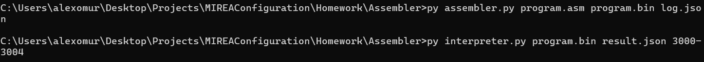
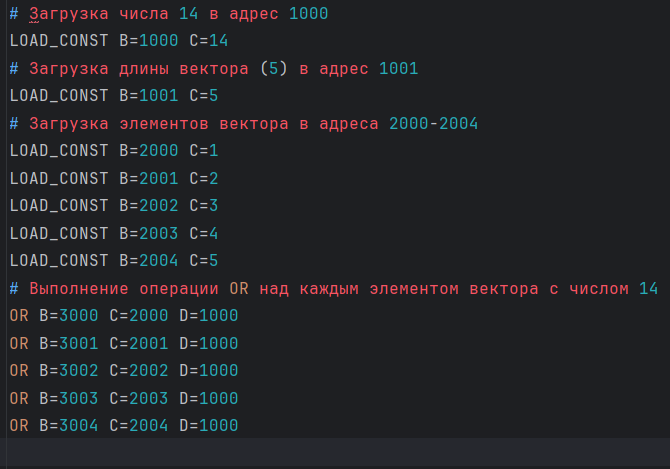
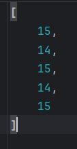

# Задание №4

Разработать ассемблер и интерпретатор для учебной виртуальной машины (УВМ). Система команд УВМ представлена далее.

## Ассемблер

Для ассемблера необходимо разработать читаемое представление команд УВМ. Ассемблер принимает на вход файл с текстом исходной программы, путь к которому задается из командной строки. 

Результатом работы ассемблера является бинарный файл в виде последовательности байт, путь к которому задается из командной строки. Дополнительный ключ командной строки задает путь к файлу-логу, в котором хранятся ассемблированные инструкции в духе списков “ключ=значение”, как в приведенных далее тестах.

## Интерпретатор

Интерпретатор принимает на вход бинарный файл, выполняет команды УВМ и сохраняет в файле-результате значения из диапазона памяти УВМ. Диапазон также указывается из командной строки.

Форматом для файла-лога и файла-результата является JSON.

Необходимо реализовать приведенные тесты для всех команд, а также написать и отладить тестовую программу.

---

## Система команд УВМ

### Загрузка константы

| A   | B       | C         |
|-----|---------|-----------|
| Биты 0—6 | Биты 7—26 | Биты 27—43 |

- **Код команды**: 59
- **Описание**:
  - Размер команды: 9 байт
  - Операнд: поле C
  - Результат: значение в памяти по адресу, которым является поле B.

#### Тест
- **Параметры**: A=59, B=645, C=210
- **Бинарный код**: `0xBB, 0x42, 0x01, 0x90, 0x06, 0x00, 0x00, 0x00, 0x00`

---

### Чтение значения из памяти

| A   | B       | C         |
|-----|---------|-----------|
| Биты 0—6 | Биты 7—26 | Биты 27—46 |

- **Код команды**: 109
- **Описание**:
  - Размер команды: 9 байт
  - Операнд: значение в памяти по адресу, которым является поле C.
  - Результат: значение в памяти по адресу, которым является поле B.

#### Тест
- **Параметры**: A=109, B=898, C=662
- **Бинарный код**: `0x6D, 0xC1, 0x01, 0xB0, 0x14, 0x00, 0x00, 0x00, 0x00`

---

### Запись значения в память

| A   | B       | C         | D         |
|-----|---------|-----------|-----------|
| Биты 0—6 | Биты 7—26 | Биты 27—41 | Биты 42—61 |

- **Код команды**: 69
- **Описание**:
  - Размер команды: 9 байт
  - Операнд: значение в памяти по адресу, которым является поле D.
  - Результат: значение в памяти по адресу, которым является сумма адреса (значение в памяти по адресу, которым является поле B) и смещения (поле C).

#### Тест
- **Параметры**: A=69, B=22, C=86, D=156
- **Бинарный код**: `0x45, 0x0B, 0x00, 0xB0, 0x02, 0x70, 0x02, 0x00, 0x00`

---

### Бинарная операция: побитовое "или"

| A   | B       | C         | D         |
|-----|---------|-----------|-----------|
| Биты 0—6 | Биты 7—26 | Биты 27—46 | Биты 47—66 |

- **Код команды**: 82
- **Описание**:
  - Размер команды: 9 байт
  - Первый операнд: значение в памяти по адресу, которым является значение в памяти по адресу, которым является поле D.
  - Второй операнд: значение в памяти по адресу, которым является поле C.
  - Результат: значение в памяти по адресу, которым является значение в памяти по адресу, которым является поле B.

#### Тест
- **Параметры**: A=82, B=1014, C=733, D=244
- **Бинарный код**: `0x52, 0xFB, 0x01, 0xE8, 0x16, 0x00, 0x7A, 0x00, 0x00`

---

## Тестовая программа

Выполнить поэлементно операцию побитовое "или" над вектором длины 5 и числом 14. Результат записать в новый вектор.

## Запуск
1. Создать файл с программой на "ассемблере" 
2. Ввести команду
    ```commandline
    py assembler.py program.asm program.bin log.json
    ```
3. Ввести команду 
    ```commandline
    py interpreter.py program.bin result.json 3000-3004
    ```
4. Результат в файле result.json

## Результаты тестирования
> Запуск команд
> 
> 

> Ввод на Ассемблере
> 
> 

> Результат в json
> 
> 