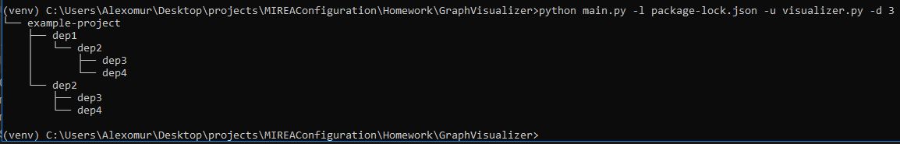
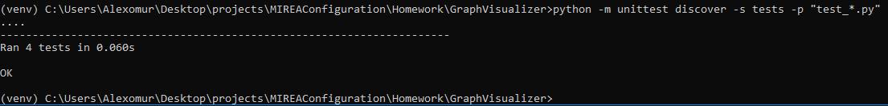

# Задание 2 - GraphVisualizer
Разработать инструмент командной строки для визуализации графа зависимостей, включая транзитивные зависимости. 
Сторонние программы или библиотеки для получения зависимостей использовать нельзя.

Зависимости определяются для файла-пакета языка **JavaScript (npm)**. 
Для описания графа зависимостей используется представление **PlantUML**. 
Визуализатор должен выводить результат на экран в виде графического изображения графа.

Ключами командной строки задаются:
* Путь к программе для визуализации графов.
* Путь к анализируемому пакету.
* Максимальная глубина анализа зависимостей.

Все функции визуализатора зависимостей должны быть покрыты тестами.

## Запуск программы
1. В консоли сменить директорию на MIREAConfiguration
2. Запустить виртуальное окружение:
    ```commandline
    venv\Scripts\activate
    ```
3. Сменить директорию на директорию, в которой лежит этот README файл
4. Активировать файл main.py:
    ```commandline
    python main.py
    ```
Пример работы программы:

   
Доступные параметры:
   * `--lockfile_path` `-l` - Путь к файлу package-lock.json (по-умолчанию "package-lock.json")
   * `--plantuml_path` `-u` - Путь к программе для визуализации (по-умолчанию "visualizer.py")
   * `--max_depth` `-d` - Максимальная глубина анализа зависимостей (по-умолчанию 2)


## Запуск тестов
1. В консоли сменить директорию на MIREAConfiguration
2. Запустить виртуальное окружение:
    ```commandline
    venv\Scripts\activate
    ```
3. В консоли сменить директорию на директорию, в которой лежит этот README файл
4. Ввести команду:
    ```commandline
    python -m unittest discover -s tests -p "test_*.py"
    ```
Пример работы тестов:


## Рекомендации по просмотру коммитов
1. В указанном репозитории открыть Pull requests
2. Просмотреть список закрытых PR
3. В PR `GraphVisualizer init` можно просмотреть историю коммитов

P.S. Для проверки работы программы рекомендуется клонировать репозиторий из ветки `Homework`, так как уже после закрытия указанного PR были добавлены некоторые модификации