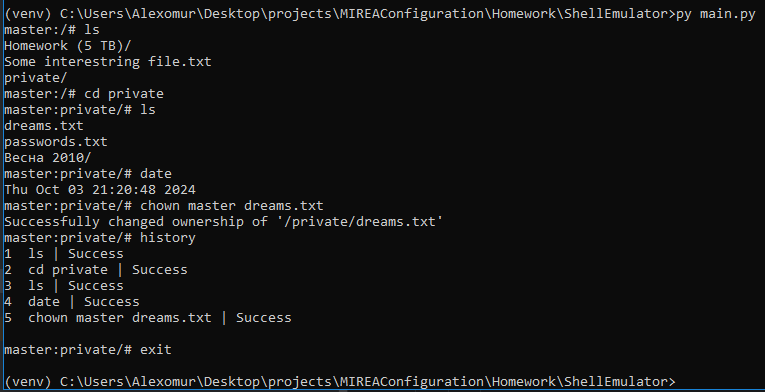
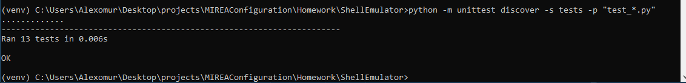

# Задание 1 - ShellEmulator
Разработать эмулятор для языка оболочки ОС. Необходимо сделать работу эмулятора как можно более похожей на сеанс shell в UNIX-подобной ОС.

Эмулятор должен запускаться из реальной командной строки, а файл с виртуальной файловой системой не нужно распаковывать у пользователя.

Эмулятор принимает образ виртуальной файловой системы в виде файла формата zip. Эмулятор должен работать в режиме CLI.

Конфигурационный файл имеет формат toml и содержит:
* Имя пользователя для показа в приглашении к вводу.
* Путь к архиву виртуальной файловой системы.

Необходимо поддержать в эмуляторе команды ls, cd и exit, а также
следующие команды:
1. date.
2. chown.
3. history.

Все функции эмулятора должны быть покрыты тестами, а для каждой из
поддерживаемых команд необходимо написать 2 теста.

## Запуск программы
1. В консоли сменить директорию на MIREAConfiguration
2. Запустить виртуальное окружение:
    ```commandline
    venv\Scripts\activate
    ```
3. Сменить директорию на директорию, в которой лежит этот README файл
4. Активировать файл main.py:
    ```commandline
    python main.py
    ```
Пример работы программы:


## Запуск тестов
1. В консоли сменить директорию на директорию, в которой лежит этот README файл
2. Ввести команду:
    ```commandline
    python -m unittest discover -s tests -p "test_*.py"
    ```
Пример работы тестов:


## Рекомендации по просмотру коммитов
1. В указанном репозитории открыть Pull requests
2. Просмотреть список закрытых PR
3. В PR `Shell Emulator task` можно просмотреть историю коммитов до переписывания программы под новые требования
4. Если среди закрытых PR нет `ShellEmulator rework`, просмотреть список открытых PR
5. В PR `ShellEmulator rework` можно просмотреть историю коммитов после переписывания программы под новые требования

P.S. Для проверки работы программы рекомендуется клонировать репозиторий из ветки `ShellEmulator`
